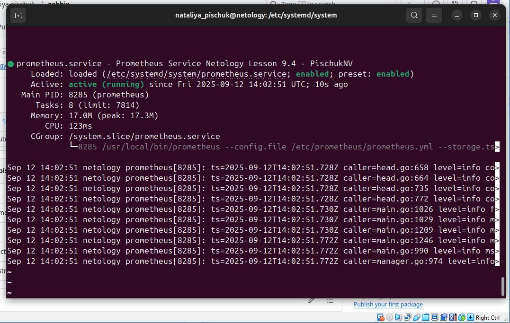
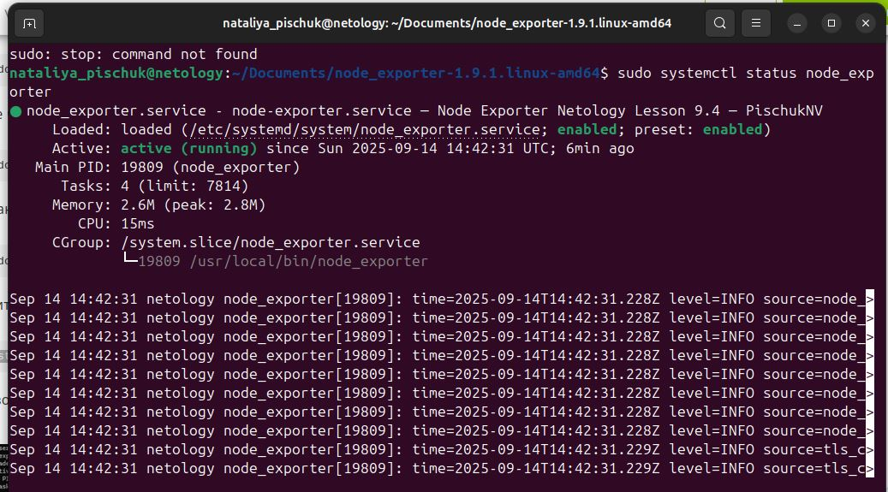

### Задание 1
Установите Prometheus.

Процесс выполнения
Выполняя задание, сверяйтесь с процессом, отражённым в записи лекции
Создайте пользователя prometheus
Скачайте prometheus и в соответствии с лекцией разместите файлы в целевые директории
Создайте сервис как показано на уроке
Проверьте что prometheus запускается, останавливается, перезапускается и отображает статус с помощью systemctl

### Решение

### Задание 2
Установите Node Exporter.

Процесс выполнения
Выполняя ДЗ сверяйтесь с процессом отражённым в записи лекции.
Скачайте node exporter приведённый в презентации и в соответствии с лекцией разместите файлы в целевые директории
Создайте сервис для как показано на уроке
Проверьте что node exporter запускается, останавливается, перезапускается и отображает статус с помощью systemctl

### Решение

